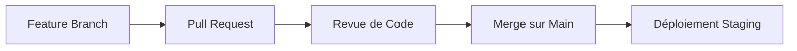

Voici un **README.md** professionnel et complet pour votre projet Budget App Backend :

---

# Budget App Backend

## 📌 Description
Backend Node.js/Express pour une application de gestion budgétaire offrant :
- **Authentification** sécurisée (JWT)
- **Gestion des transactions** (revenus/dépenses)
- **Suivi d'objectifs** financiers
- **Statistiques** détaillées pour visualisations
- API RESTful conforme aux meilleures pratiques

## 🚀 Fonctionnalités
| Module | Endpoints | Description |
|--------|-----------|-------------|
| **Authentification** | `POST /register`<br>`POST /login` | Création de compte et connexion sécurisée |
| **Transactions** | `GET/POST /transactions`<br>`DELETE /transactions/:id` | Gestion CRUD des opérations financières |
| **Objectifs** | `GET/POST /goals`<br>`PUT/DELETE /goals/:id` | Définition et suivi des objectifs mensuels |
| **Statistiques** | `GET /stats/categories`<br>`GET /stats/monthly` | Données pour graphiques et analyses |
| **Catégories** | `GET /categories` | Liste des catégories de transactions |

## 📦 Structure du Projet
```
budget-app-backend/
├── config/
│   ├── db.js              # Configuration de la base de données
├── controllers/
│   ├── auth.controller.js # Authentification
│   ├── transaction.controller.js 
│   ├── goal.controller.js
│   ├── stats.controller.js
├── models/
│   ├── User.js            # Modèle utilisateur
│   ├── Transaction.js     # Modèle transaction
│   ├── Goal.js            # Modèle objectif
├── routes/
│   ├── authRoutes.js
│   ├── transactionRoutes.js
│   ├── goalRoutes.js
├── seeders/               # Données initiales
├── .env.example           # Variables d'environnement
├── app.js                 # Point d'entrée
```

## 🔧 Technologies
- **Node.js** (v18+)
- **Express** (Framework web)
- **PostgreSQL** (Base de données)
- **Sequelize** (ORM)
- **JWT** (Authentification)
- **Bcrypt** (Hachage des mots de passe)

## 🛠️ Installation
1. **Cloner le dépôt** :
   ```bash
   git clone https://github.com/votre-repo/budget-app-backend.git
   cd budget-app-backend
   ```

2. **Installer les dépendances** :
   ```bash
   npm install
   ```

3. **Configurer l'environnement** :
   - Copier `.env.example` vers `.env`
   - Remplir les variables :
     ```env
     DB_USER=votre_utilisateur
     DB_PASSWORD=votre_mdp
     DB_NAME=gestionnaire_db
     JWT_SECRET=votre_secret
     ```

4. **Démarrer le serveur** :
   ```bash
   npm run dev
   ```
   *Le serveur écoute sur http://localhost:5000*

## 📚 Documentation API
[Documentation complète des endpoints](#) [text](../../Downloads/deepseek_markdown_20250613_04f2e2.pdf)

Exemple de requête :
```bash
curl -X POST http://localhost:5000/api/transactions \
  -H "Authorization: Bearer VOTRE_JWT" \
  -H "Content-Type: application/json" \
  -d '{"amount": 100, "type": "income", "CategoryId": 1}'
```

## 🧪 Tests
Lancer les tests avec :
```bash
npm test
```

**Couverture des tests** :
- Authentification
- Validation des données
- Gestion des erreurs

## 🔄 Workflow Git


## 🌐 Déploiement
**Prérequis** :
- PostgreSQL configuré
- Variables d'environnement définies

**Méthodes** :
1. **Local** :
   ```bash
   npm start
   ```

2. **Docker** :
   ```bash
   docker-compose up --build
   ```

3. **Heroku** :
   ```bash
   heroku create
   git push heroku main
   ```

## 🤝 Contribution
1. Forker le projet
2. Créer une branche (`git checkout -b feature/ma-fonctionnalite`)
3. Commiter (`git commit -m 'Ajout ma-fonctionnalite'`)
4. Pusher (`git push origin feature/ma-fonctionnalite`)
5. Ouvrir une Pull Request

## 📜 License
LDS TOGO © 2025